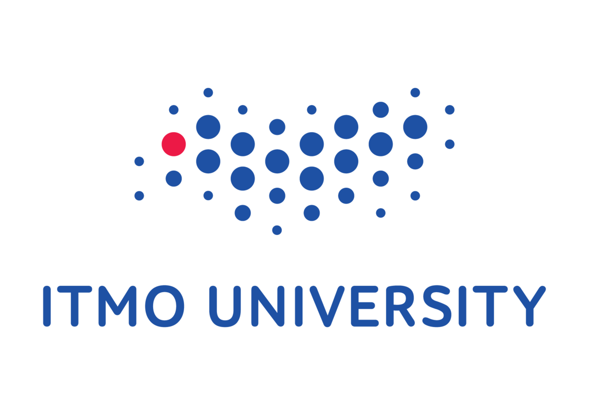
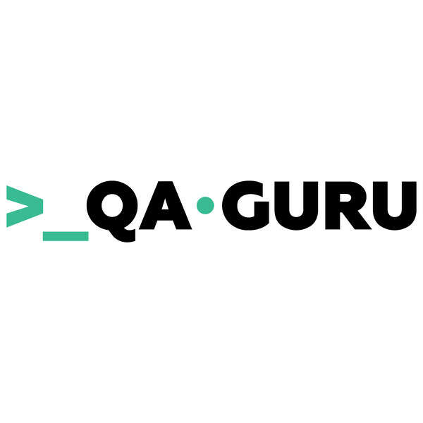

<h1 align="center">Всем привет, меня зовут Лена и я QA Engineer с 2019г.</a> 
</h1>

<h3 align="center">Образование: </h3>
<table width="100%" border='0'>
   <tr> 
    <td width="10%" valign="bottom"></td><td valign="middle">Федеральное государственное автономное образовательное учреждение высшего образования «Национальный исследовательский университет <a target="_blank"  <a target="_blank" href="https://itmo.ru/">ИТМО</a> »</td></tr>
    <td width="10%" valign="bottom"></td><td valign="middle">Школа инженеров по автоматизации тестирования <a target="_blank" href="https://qa.guru">qa.guru</a> (В процессе)).</td></tr>
   </tr>
  </table>
   

<h3 align="center">Мои инструменты и технологии:</h3>

 

 
 

 
 
 
  
   
  
  

Мой демо-проект по автоматизации UI/API тестирования для компании  - [Ссылка на проект](https://github.com/AkimovaLena/qa_guru_final_project)
Мой демо-проект по автоматизации mobile тестирования для компании  - [Ссылка на проект](https://github.com/AkimovaLena/qa_guru_final_project_mobile)
